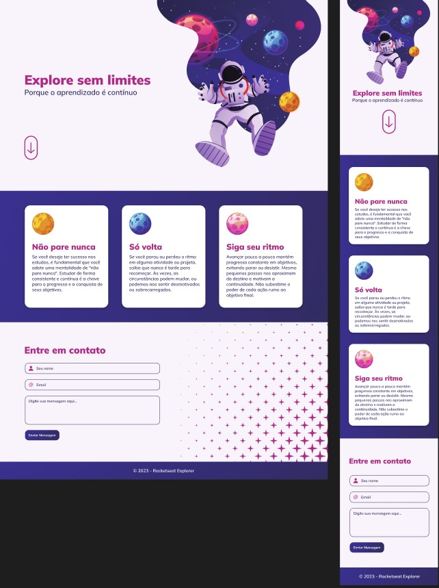

  

  

## 🖥️ Projeto
Esse é o resultado do desafio intensivão do stage 01 ao stage 04 do curso Explore onde fizemos um projeto web de uma página onde aplicamos os conhecimentos adquididos no stages, como:

- regra do mobile first;
- aplicação responsiva;
- unidades de medida flexíveis (rem);
- variáveis no CSS;
- acessibilidade: tags semântica no HTML.

## 🚀 Tecnologias
Esse projeto foi desenvolvido durante o cursos de Explore da Rocketsat com as seguintes tecnologias:

- HTML
- CSS
- GIT E GITHUB
- FIGMA

## 🏷️layout
Você pode visualizar o layout do projeto através 
[desse link](https://www.figma.com/file/UU7YEfuOb0BOwxnsoB6GlX/Explore-sem-limites-(Copy)?node-id=0%3A1&mode=dev).
É necessario ter uma conta no [Figma](https://www.figma.com).